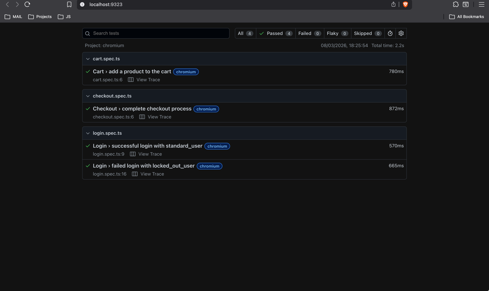
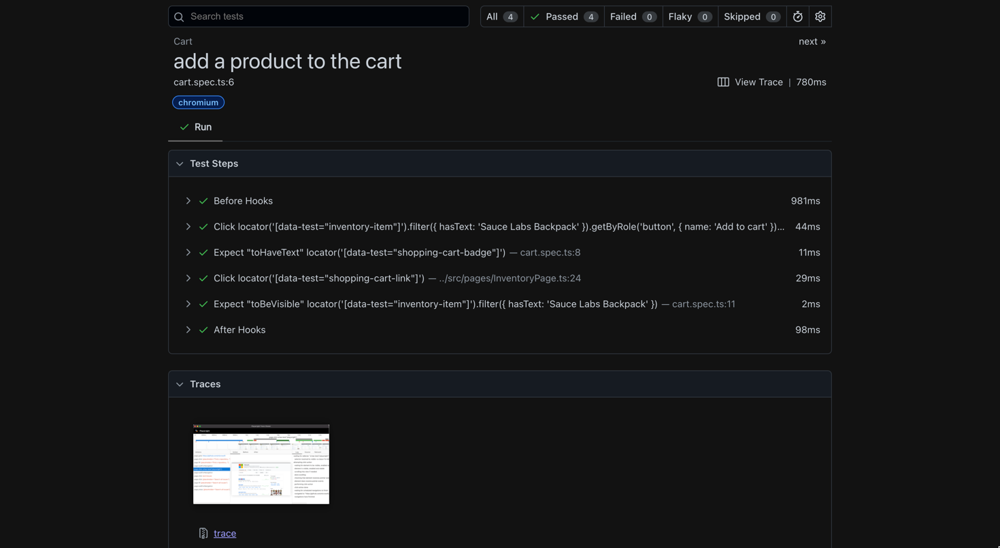
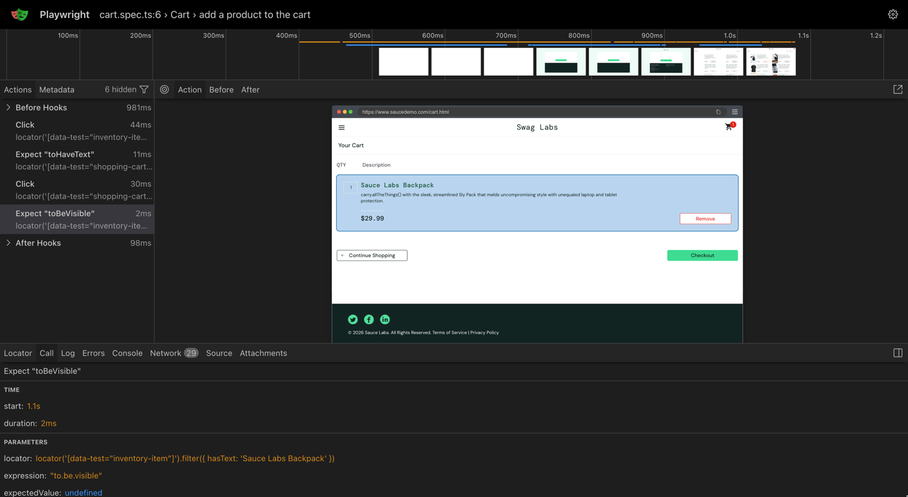
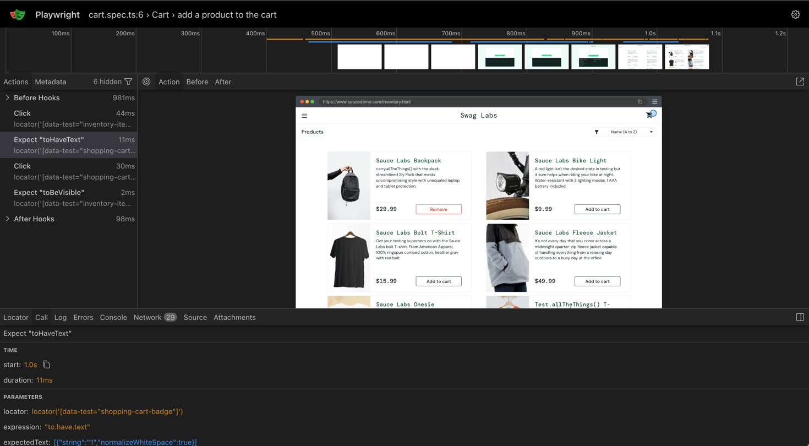

# SwagAutomation

UI test automation framework for [saucedemo.com](https://www.saucedemo.com) built with Playwright and TypeScript.

## Prerequisites

- Node.js 20+
- Docker (optional, for containerized runs)

## Setup

```bash
npm install
npx playwright install chromium
```

## Running Tests

```bash
npm test                # run all tests (headless)
npm run test:headed     # run with browser visible
npm run test:ui         # open Playwright UI mode
npm run test:debug      # run with Playwright Inspector
npm run test:docker     # run in Docker container
```

## Viewing Reports

Uses Playwright's built-in HTML Reporter. After a test run, a report is generated in `playwright-report/`:

```bash
npm run report
```

Screenshots are captured automatically on test failure. Traces are recorded on first retry. In CI, the report is uploaded as a GitHub Actions artifact.

## Test Scenarios

| Test | File | Description |
|------|------|-------------|
| Successful login | `tests/login.spec.ts` | Login with `standard_user` and verify inventory page |
| Failed login | `tests/login.spec.ts` | Login with `locked_out_user` and verify error message |
| Add to cart | `tests/cart.spec.ts` | Add a product and verify it appears in cart |
| Checkout | `tests/checkout.spec.ts` | Full checkout flow from cart to order confirmation |

## Project Structure

```
.
├── src/
│   ├── pages/              # Page Object Models
│   │   ├── LoginPage.ts
│   │   ├── InventoryPage.ts
│   │   ├── CartPage.ts
│   │   ├── CheckoutStepOnePage.ts
│   │   ├── CheckoutStepTwoPage.ts
│   │   └── CheckoutCompletePage.ts
│   ├── fixtures/
│   │   └── test-fixtures.ts  # Playwright fixtures with page objects and auth setup
│   └── data/
│       └── users.ts          # Test user credentials
├── tests/                    # Test specs
│   ├── login.spec.ts
│   ├── cart.spec.ts
│   └── checkout.spec.ts
└── playwright.config.ts      # Playwright configuration
```

## Design Decisions

- **Page Object Model**: each page is a class encapsulating locators and actions, making tests readable and maintainable
- **Playwright Fixtures**: custom fixtures provide page objects and an `authenticatedPage` fixture that handles login setup, keeping tests focused on behavior
- **`data-test` selectors**: the site exposes `data-test` attributes; using `[data-test="..."]` CSS selectors provides stable, implementation-independent locators
- **No hardcoded waits**: all interactions use Playwright's built-in auto-waiting and explicit assertions
- **Parallel execution**: tests run in parallel by default for fast feedback

## CI/CD

GitHub Actions workflow is configured in `.github/workflows/run-regression.yml`. It runs on push/PR to `main`, supports manual dispatch via `workflow_dispatch`, uploads HTML reports as artifacts, and retries failed tests twice in CI.

## Screenshots








